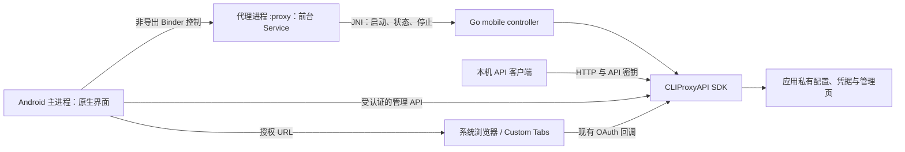

# CLIProxyAPI Android 迁移实施计划

版本：1.0 · 编写日期：2026-09-26 · 状态：待实施，尚无 Android 构建或真机验收结果。

本文将迁移拆成可独立检查、可回退的工程阶段。目标是交付可靠的 Android 本地代理，保留现有协议转换、凭据管理及目录更新能力，并以实测证明裁剪收益。

## 1. 基线、目标与首版范围

### 1.1 代码基线

| 项目 | 基线 |
| --- | --- |
| 上游 | `https://github.com/router-for-me/CLIProxyAPI` |
| 已检查提交 | `ed980be34b9981735eaa16941956b1e8d9abfb7c`，2026-09-26 |
| 本地代码仓库 | `D:\AICode\claude\cliproxyapi2android` |
| 模块 | `github.com/router-for-me/CLIProxyAPI/v7` |
| Go 最低要求 | 该提交的 `go.mod` 声明 `go 1.26.0` |
| 原始方案 | 同目录 `PLAN.md`，保留供对照 |

后续路径如无特殊说明，均相对上述源码仓库。本文出现的新增文件、接口及脚本是实施任务，不表示当前已经存在。开始实施时先确认提交；若更换基线，重新执行阶段 P0 的审计。

### 1.2 首版产品决策

采用以下默认范围，避免首轮同时承担多个产品方向：

| 决策 | 首版选择 | 影响 |
| --- | --- | --- |
| 主要交付 | 可自行安装的 Android APK | 原生界面负责启停、状态、凭据导入入口和管理页入口 |
| 辅助交付 | Android CLI | 用于 Termux/ADB 调试、独立验证和熟悉命令行的用户 |
| ABI | `arm64-v8a` 为必需，`x86_64` 为模拟器验证目标 | 暂不增加 32 位支持 |
| Android | `minSdk=26`；初始工程以 `compileSdk/targetSdk=36` 为基线 | 发布时重新核对目标 SDK 要求；NDK API 级别与 targetSdk 分开记录 |
| 默认监听 | `127.0.0.1:8317`，API 要求密钥 | 回环监听仍需认证，不能视为同一应用专属通道 |
| 局域网共享 | 首版不提供开关；作为后续独立功能 | 后续补 TLS、认证、监听地址和跨设备实测后开放 |
| 运行方式 | 用户主动开启和停止；常驻通知含停止操作 | 不承诺系统杀进程后无条件自恢复或全天候不断流 |
| 核心生命周期 | 一个代理进程承载一次运行会话 | 再次启动创建新代理进程，避免复用上游一次性全局组件 |
| 配置 UI | 复用管理 Web 页面，配少量原生控制 | 优先外部浏览器；首版不向远程更新的 HTML 暴露 JS→JNI 桥 |
| 分发范围 | 自用/测试 APK 先完成；商店发布单独验收 | `specialUse` 的商店审核通过不能由本计划预先保证 |

### 1.3 功能范围

保留：现有文本、代码、多模态图文、工具调用、推理参数转换、SSE、已有 Codex WebSocket 路径、文件凭据、账号轮换、冷却及 token 自动刷新。模型目录、Codex client 目录、Devin 目录和管理页面更新都属于交付范围。

裁剪：远程存储后端、Home/Redis 集群通信、mDNS 广播与发现、TUI、桌面浏览器启动器、WebRTC 实时媒体链路。WebRTC 裁剪不等于删除所有 WebSocket 能力。

首版关闭动态外部插件装载、pprof 及其他未验证的额外监听/外部执行能力；保留这些包中被核心注册流程依赖的公共部分。P0 必须检查它们是否仍引入 Android 不支持的实现，不能把“配置关闭”当作“不会编译”。

“保留”表示实施目标。每个服务商的登录、刷新和推理是否通过，最终以测试矩阵标识；没有账号完成真实测试的项目明确记为未验证。

## 2. 已核实事实与实施约束

| 已核实事实 | 源码证据 | 计划中的处理 |
| --- | --- | --- |
| `media.go` 不是全部 Pion 依赖的唯一入口 | `internal/client/codex/live/tcp_proxy.go` 也引入 ICE、SDP、STUN | 以整个实际依赖图确定媒体裁剪边界 |
| Home 调用面大于原方案的桩列表 | `internal/home/kv_helpers.go`、`internal/cache/*`、`sdk/cliproxy/service_home.go` | 审计导出符号、同包调用和方法集，编译校验 |
| mDNS 文件同时包含广播端和发现端 | `internal/discovery/zeroconf.go`；`internal/cmd/discover.go` | 同时替换 Advertiser 与 Browser |
| 缺失配置文件会导致 watcher 启动失败 | `internal/watcher/events.go` 的 `watcher.Add(configPath)` | 先创建并验证实际配置文件，再启动服务 |
| 管理 API 注册需要管理凭据 | `internal/api/server.go` 的 `hasManagementSecret` | 首次启动生成管理口令，并验收管理接口 |
| 自动更新由桌面入口显式启动 | `cmd/server/main.go` 的 `StartAutoUpdater` 与 `startModelCatalogUpdaters` | 移动入口显式启动，逐项记录初始化责任 |
| 多个全局组件不能简单 Stop 后再次 Start | 各 model updater、management updater、`sdk/cliproxy/usage/manager.go` 中的 `sync.Once` | 首版使用新进程承载下一次运行 |
| 现有 `OnAfterStart` 不能单独证明就绪 | `sdk/cliproxy/service_lifecycle.go` 在 sleep 后调用，且 watcher 初始化在后 | 增加准确、实例相关的 ready/error 信号 |
| Run 的 shutdown context 在启动时创建 | 同上：启动时设置 30 秒期限，退出时才使用 | 修正为真正开始清理时创建期限，做长时间运行后停止测试 |
| CLI 没有 `--port` 参数 | `cmd/server/main.go` 的 flag 注册 | 通过 `--config` 与 YAML 设置端口 |

### 2.1 修改原则

1. 优先保留 translator、thinking、executor、auth 的业务行为和既有测试。
2. 允许为平台边界、配置入口、就绪通知和资源清理增加少量明确的接缝；不把“零行修改”作为高于正确性的目标。
3. 每个上游文件修改记录在 `docs/android/patch-ledger.md`：原因、调用方、测试、是否可提交上游、合并检查点。
4. 构建约束只加在确定的平台实现文件。已有约束合并为逻辑表达式，保留许可头，遵守 Go 的约束位置与空行规则。
5. 优先保留原文件名以减少差异；不承诺无合并冲突。Git 能检测重命名，不能据此推导“重命名必然冲突”或“原名必然无冲突”。
6. 不人工删除桌面构建仍使用的 `go.mod` 依赖。Android 依赖去除用目标平台的 `go list` 和构建产物证明。[Go 模块说明](https://go.dev/ref/mod#go-mod-tidy)

## 3. 推荐架构



### 3.1 Android 进程边界

- `ProxyForegroundService` 放入 `android:process=":proxy"`，`exported=false`。这是同 UID 的独立进程，不启用会改变存储/权限条件的 `isolatedProcess`。
- 只有代理进程加载 `libcliproxy.so`。检查 `Application.onCreate`，避免主进程无意加载第二份 Go runtime。
- 主进程使用 Binder 发起启停并接收状态；监听 Binder death，区分正常停止与进程意外退出。
- 第一版使用 `START_NOT_STICKY`，显式停止后不自动拉起；Activity 重建只重新连接现有服务，不重建代理。
- 一个代理进程最多运行一次 core 会话；会话结束后不再调用原生 Start。用户再启动时，宿主确保旧进程已经退出，再建立新会话。

manifest 的进程及导出语义以 [Android Service 声明文档](https://developer.android.com/guide/topics/manifest/service-element) 为准。独立 `.so` 的集成说明也必须声明这个单会话契约；不能让其他宿主误认为同一进程可以无限次重启。

独立进程增加 IPC 与进程内存成本，但能让 Go 的单例、更新器、usage 队列和原生崩溃边界更容易管理。该成本纳入 P5 测量；同进程反复启停可在后续完整移除一次性全局状态后再评估。

### 3.2 正常退出与异常退出

`stopSelf()` 不保证 Android 立即销毁进程。实施时必须明确完成进程退役：

1. 主进程记录用户期望状态为停止，禁用自动重绑；代理控制器停止接收新业务请求。
2. 清理 core、更新任务、回调监听器和打开的文件；给正在结束的请求一个可配置的清理期限。
3. 报告 `Stopped` 或 `StopTimedOut`，移除前台通知，停止 Service；主进程解除绑定。
4. 对专用于代理的 `:proxy` 进程，由宿主进程管理代码实施受控自退出。必须校验当前进程名，并确认其中没有其他业务 Service。
5. 主进程通过 Binder death 确认旧实例消失，才允许下一次启动。不得仅等待固定毫秒数，也不得对主进程调用退出。

停止超时必须保留错误诊断。若使用进程退出兜底，标记为强制结束；这不算优雅清理通过。配置/凭据写入的原子性与进程中断恢复需单独验收。

### 3.3 新增代码组织建议

| 位置 | 责任 |
| --- | --- |
| `cmd/mobile/main_android.go` | C ABI 导出、参数转换，保持薄层 |
| `cmd/mobile/jni_bridge_android.c`、对应 `.h` | JNI 方法绑定、字符串转换和异常检查 |
| `internal/mobilecore/` | 平台无关控制器、状态机、配置策略、初始化责任表；便于宿主单测 |
| 六类外围模块内的 `*_android.go` | 依赖替换与明确的不支持行为 |
| `android/` | 原生 UI、Service、Binder、JNI 声明、APK 工程 |
| `scripts/android/` | 构建、依赖审计、产物检查和设备验收脚本 |
| `docs/android/` | 构建锁定信息、能力表、修改台账、测试和性能报告 |

`internal/mobilecore` 的通用代码不得依赖只在 Android 存在的符号；平台实现通过小接口注入，使状态机能在宿主上运行 race 测试。

## 4. 裁剪实施规范

### 4.1 文件和符号清单

在写桩前生成 `docs/android/boundaries.json`，每个边界记录：原文件、Android 替换文件、共享文件、被其他文件引用的符号、禁止依赖、保留行为和测试。

使用源码搜索辅助发现，以 Go 包加载/类型信息和两个入口的构建结果作为完整性依据。关注构造器、接口方法、公开字段、错误值、同包私有符号及原有测试引用；运行时分支不免除编译期类型检查。

### 4.2 各边界的具体决策

| 边界 | 实施动作 | 验收重点 |
| --- | --- | --- |
| Postgres / Git / S3 | 隔离相应 store 实现，提供所有必要类型与方法；构造/使用时返回明确的不支持错误 | 两个入口编译；FileTokenStore 读写通过；显式配置远程存储不能静默丢失数据 |
| Home / Redis | 隔离 Redis client；补全使用中的符号；保留纯本地公共辅助逻辑 | `CurrentKVClient()` 在 Android 返回本地模式；缓存、冷却、token 刷新不落入 Home 路径 |
| WebRTC | 联合检查 `media.go`、`tcp_proxy.go` 及同包其他文件，将专属媒体实现整体隔离 | 目标依赖图没有 `github.com/pion/`；Realtime 媒体请求给出明确错误；普通 SSE/WebSocket 不回归 |
| mDNS | 替换 Advertiser 与 Browser，保留 `ServiceSpec`、发现结果等共享类型 | 普通启动不广播；显式 discover 操作返回不支持；CLI 仍能编译 |
| TUI | 隔离渲染与终端实现；保留入口所需日志/客户端桩 | 普通运行通过；`--tui`、`--standalone` 快速返回清楚的错误 |
| browser | CLI 通过既有手工授权路径展示链接；App OAuth 走管理 API | 不执行桌面 opener；无重复打开浏览器；不把授权 URL 写入持久日志 |
| 插件与额外 OS 能力 | 审计 `pluginhost` 的 loader、RPC/外部进程与平台约束；Android 禁用外部装载 | `GOOS=android` 也满足部分 Linux 约束，不能只检查文件名；内置 translator 注册仍存在 |

### 4.3 Home 的强制本地语义

首版做两层保障：

1. 所有 Android 配置入口拒绝 `Home.Enabled`、Home bootstrap 参数和远程存储设置。覆盖 CLI 初始配置、App 导入、管理 API 保存、文件热重载。
2. `internal/home/global.go` 增加平台边界，Android 的 `Current()` 恒为 nil；`SetCurrent` 不安装实例，`ClearCurrent`/`ClearCurrentIf` 保持安全空操作。相关符号必须在清单中登记并测试。

CLI 中可能先于配置加载发生的 `--home-jwt` bootstrap、远程存储环境变量处理也应在开始网络/持久化操作前拒绝。必要的入口检查属于允许的小型平台改动。

第二层维持缓存判断的正确性，第一层避免配置把服务生命周期引入集群分支。不能只依靠启动时执行一次 `cfg.Home = HomeConfig{}`。

拒绝发生在配置提交前，返回具体字段错误并保持当前有效配置。平台策略优先集中到公共的加载/校验入口，避免在每个 handler 重复实现。

### 4.4 桩的行为规则

- 显式请求被移除能力时，返回可识别错误及用户提示，不能伪造成功。
- 可选后台广播的停止等清理操作允许幂等空实现；能力表明确标识关闭。
- 不用 `return nil` 掩盖凭据写入、配置持久化等失败。
- 共享结构体优先保持单一来源；若最小差异要求双平台重复声明，增加结构/接口漂移检查。
- 每完成一个边界就构建 CLI 与 mobile，记录依赖变化；不积累六组修改后一次性排错。

## 5. 配置、认证与首次启动

### 5.1 文件布局

以宿主传入的绝对私有目录为根，集中计算路径。建议在 `context.noBackupFilesDir/cliproxy` 保存运行数据；CLI 使用用户指定的私有目录。

```text
cliproxy/
  config.yaml          # 唯一生效配置
  auths/               # 原有 FileTokenStore 凭据
  static/              # management.html 及回滚版本
  cache/               # 经验证的更新缓存
  logs/                # 有限额且脱敏的日志
```

管理页目录必须与 `managementasset.StaticDir(configPath)` 的真实解析规则对齐；日志、插件默认目录、临时目录、Home/XDG 目录也要审计，不能让 Android 的当前工作目录决定落盘位置。需要环境变量的组件，由代理进程在加载/使用前设置，记录在初始化清单中。

### 5.2 初始化顺序

1. 校验目录和端口范围，创建所需目录；避免跟随用户导入配置中的任意路径。
2. 配置不存在时，从随 APK 打包的、与该上游提交匹配的模板生成配置。随机生成独立的代理 API 密钥与管理口令，不使用演示密码。
3. 先解析与校验，再用同目录临时文件及原子替换落盘；之后调用上游正常配置加载器，让默认值、标准化、管理口令哈希等逻辑正常执行。
4. 已有配置解析失败时报告原因，保留原文件；不把损坏配置降级为空配置继续服务。
5. 校验移动端策略：回环监听、受认证 API、Home/远程存储/外部插件关闭、路径受控。
6. 仅当管理页不存在时释放 APK 内置稳定版本；不覆盖用户已在使用的更新版本。
7. 初始化 token store、SDK、更新器，再进入就绪检测。

主进程所需管理口令副本使用宿主安全存储；所有进程只让代理进程写运行配置/凭据。主进程的修改经受认证 API 或 Binder 提交，避免两套写入器竞争。

### 5.3 热重载约束

密钥、账号、模型配置按上游支持能力热更新。监听端口、进程目录、平台禁用功能不能在后台悄悄改变：要么拒绝，要么明确保存为“下次启动生效”。App 显示生效配置与待重启状态。

启动参数与磁盘配置保持单一权威来源。不能启动时覆盖 Host/AuthDir，随后 watcher 又从原 YAML 恢复旧值。

隐私与认证验收包括：错误 API 密钥被拒绝、管理 API 未认证不可用、日志无 token/授权码/完整授权 URL、凭据不进入系统备份或设备迁移包。除选择 no-backup 目录外，也配置并检查对应系统版本的备份规则。[Android 备份说明](https://developer.android.com/identity/data/autobackup)

## 6. Native 接口、就绪与资源清理

### 6.1 控制协议

以下为拟实现的语义，不是上游已有 API：

| 操作 | 返回语义 |
| --- | --- |
| `Start(options)` | 返回已受理/参数错误/已有运行；已受理不等于启动成功 |
| `GetStatus()` | 返回进程会话 ID、generation、状态、有效地址、最近错误码和脱敏消息 |
| `PollEvent(timeout)` | 有界等待状态/诊断事件；超时、停止和事件溢出有明确表示 |
| `Stop()` | 幂等发起停止；完成通过状态事件或状态查询确认 |

原生终态后再次 Start 返回 `ProcessRestartRequired`。JNI 调用不承担长时间阻塞；Kotlin 在工作线程拉取事件并更新 UI。用户按钮可以重复点击，但命令经单一串行控制器排序。

事件队列有容量上限与序号；消费者落后时收到丢失提示并重新读取状态快照。关键终态必须保存在状态快照中，不能因诊断日志占满队列而丢失；也不能为避免丢事件无限阻塞 core。

### 6.2 状态机

```text
New -> Starting -> Running -> Stopping -> Stopped
          |           |          |
          +-> Failed  +-> Failed +-> StopTimedOut
```

`Starting` 中收到停止必须取消本次启动，不能随后发布 Running。每次异步事件带会话 ID/generation；旧进程/旧实例的事件不能更改新会话状态。

用实例局部的 context、cancel 和 done channel 管理生命周期。关闭 done 只能有一个 owner，闭包显式捕获本实例通道；避免读取可能已被其他线程置空的全局变量。

### 6.3 就绪的真实定义

允许在 `internal/api` 与 `sdk/cliproxy` 增加小型、可选的就绪接口：

1. HTTP listener 已成功 bind，TLS 如启用也完成校验。
2. 服务没有早期退出；必要的 auth store、watcher、执行器等组件初始化成功。
3. 通知携带本实例信息；不能以旧服务的 `/healthz` 响应充当本次启动成功。

现有 sleep 与 `OnAfterStart` 不满足以上条件，不直接复用为 ready。保留原有 SDK 调用的默认行为，将新增信号设计成可选。验收必须包含端口被占用、配置不可读、watcher 初始化失败、启动中立即停止。

### 6.4 清理顺序与期限

首先在真正进入退出阶段创建新的 shutdown context，修正基线在 Run 开始时就启动 30 秒倒计时的问题。清理只由一个控制流负责，其他线程等待其结果。

普通停止：停止接入新业务请求，等待/取消活动请求，结束 OAuth 等候、watcher、token 刷新、模型/资产更新、usage 分发，关闭监听与日志，然后发布终态。清理错误要聚合报告。

普通停止可以有独立的合理清理预算；平台超时回调使用更短的应急停止路径，不能在 Service 主线程等待长时间 Go 清理。清理期限不应变成对已建立 SSE 业务流的新常规超时。

### 6.5 JNI 约束

- 使用 `//export` 的 Go 文件前导 C 代码只放声明/头文件；C 函数定义和静态状态放独立 `.c` 文件。[cgo 约束](https://pkg.go.dev/cmd/cgo#hdr-C_references_to_Go)
- 首版只用 Kotlin 拉取事件，不实现 goroutine 主动回调 Java 的第二套通道。
- 明确 C 字符串分配/释放责任，失败路径同样释放；检查 JNI null 与 pending exception。
- 明确使用 UTF-8 字节数组或经过正确转换的文本协议，不能默认所有任意 UTF-8 文本都符合 JNI Modified UTF-8。
- Kotlin/Java 方法签名与注册方式一致；提供必要的 R8 keep 规则，并测试开启压缩混淆的 release APK。
- 导出 native API 版本，在加载时检查宿主与 `.so` 匹配。[JNI 官方建议](https://developer.android.com/ndk/guides/jni-tips)

## 7. OAuth 与凭据闭环

### 7.1 App 的主要登录路径

1. 用户从前台界面选择服务商；宿主调用该服务商已有的、受认证的管理登录接口。
2. 接收授权 URL、state，以及可选的设备码信息。实际接口路径、参数和响应字段在 P0/P3 从路由与 handler 生成对照表，不在文档中猜测。
3. 宿主在主线程打开 Custom Tabs 或系统浏览器；设备码流程展示所需验证码。每个登录会话只打开一次。
4. 保留上游支持的 loopback callback / 回调转交 / 手工粘贴等方式，逐服务商核实固定端口、redirect URI、state 和 PKCE 要求。
5. 通过现有状态接口确认成功；必须看到凭据落盘并进入可调度账号池，不能把浏览器返回成功页作为唯一证据。
6. 重启代理进程后再次加载该凭据，验证推理与后续 token 刷新。

多个管理 handler 直接返回授权 URL，不调用 `browser.OpenURL`。App 不以拦截该函数作为登录主链路。只有实际保留了会触发 browser 包的其他入口，才为它增加单一事件转发适配。

### 7.2 边界与失败处理

- 登录进行期间维持代理会话；切换 Activity 或短暂进入浏览器不丢失 state。
- 进程退出后，未完成 OAuth 会话标记失效并引导重新开始，不重放旧 URL 或旧授权码。
- 验证用户取消、拒绝授权、回调端口占用、错误 state、回调重复、设备码过期和网络断开。
- 宿主不得为了统一界面而擅自改变服务商已注册的 redirect URI。
- 没有内置取消接口的流程，补小型会话取消接缝或在 UI 明确显示等待到期；确保退出会话会关闭回调监听器。
- CLI 优先使用既有 `--no-browser` 及手工路径，保留终端一次性链接提示；授权 URL 不进入持久应用日志。

P3 产出 `provider-matrix.md`：每个服务商分别记录已有凭据导入、API key、浏览器登录、设备码、token 刷新和实机推理结果。缺少测试账号只允许标记“未验证”，不能填通过。

## 8. 自动更新：首版策略与后续优化

### 8.1 首版保持上游调度

首版不立即新增“启动一次＋手动刷新”的调度模式。优先显式接入并验证上游现有更新行为，避免在迁移期间同时改动模型刷新逻辑。

移动入口维护 `initialization-ledger.md`，对照桌面 main 分类：必须迁移、SDK 已完成、平台禁用。至少覆盖：

| 初始化项 | 移动入口责任 |
| --- | --- |
| FileTokenStore | 显式确认注册与 base dir；不依赖不同入口的偶然默认状态 |
| translator / thinking / executor 注册 | 确认实际注册链，避免仅保留文件但未导入/初始化；使用跨协议测试证明 |
| 日志与构建版本 | 注入版本信息、输出到受控目录/宿主诊断通道，限制大小并脱敏 |
| 管理页更新 | 设置有效 config snapshot，启动 `managementasset.StartAutoUpdater` |
| 模型目录 | 启动 `StartModelsUpdater`、`StartCodexClientModelsUpdater`、`StartDevinModelsUpdater` |
| 其他版本元数据更新 | 审计桌面 main 的 Antigravity 等 updater；保留核心服务商需要的更新并登记 |
| token 自动刷新 | 确认 SDK Run 已负责，禁止宿主重复启动第二个循环 |
| usage 与插件注册 | 核查一次性状态与实际默认行为；外部装载按平台策略关闭 |

所有本会话更新循环使用会话 context，停止时取消。每次重新启动使用新代理进程，从而不复用已完成的 `sync.Once`。不得用 `context.Background()` 掩盖停止后仍继续运行的问题。

### 8.2 离线与失败回退

- 模型定义沿用内嵌 fallback；下载、JSON 校验失败继续使用最近有效的内存数据，不阻断代理启动。
- 如要承诺重启后仍保留上次下载的模型目录，必须新增缓存验证/落盘/加载逻辑及测试；首版不把这一点当作已存在能力。
- APK 内嵌一份与后端版本验证过的 `management.html`，记录来源、版本及构建时 SHA-256；全新离线安装也能打开管理页。
- 管理页更新保留旧版本，使用临时文件、大小/内容检查和原子替换；更新失败继续服务旧版本。已有 updater 是否全部做到，由 P3 审计并补齐。
- 验证远端管理页与当前后端兼容，提供“恢复随包管理页/暂停更新”操作。内置哈希能标识随包文件，不能被描述为远端更新的签名验证。
- 从源码读取默认远端地址，避免手工抄错 `router-for.me` 等域名；测试主源不可达、备用源成功、两者均失败。

### 8.3 后续调度优化的边界

若 P5 证明轮询造成可观流量或耗电，再增加统一的移动更新调度器。为每类目录提供可返回成功/无变化/失败结果的单次刷新 API，保留原周期 updater 的桌面语义。

新调度器才能实现“启动刷新、手动刷新、仅 Wi-Fi、暂停自动更新”等策略，并保证不会与原周期循环同时运行。该优化单独立项和验收，不把新增接口写成现有函数。

## 9. Android 宿主与系统约束

### 9.1 前台服务选择

首版为用户主动开启的本地代理会话，优先评估并实现 `specialUse`，在 manifest 中填写真实、具体的 subtype 说明，声明对应权限。它适用于其他类型未覆盖的有效前台用途；若进入 Google Play，必须提交用途说明并通过审核。P0/P4 对该选择形成简短决策记录，不能保证审核一定通过。[前台服务类型说明](https://developer.android.com/develop/background-work/services/fgs/service-types#special-use)

按运行时 API 分支调用：API 34+ 使用已声明的 specialUse 类型；更早系统使用与其兼容的前台启动方式，不能向旧系统盲传新增类型位。通知和后台启动限制分别按对应 API 处理。

不将 `dataSync` 当作无限期本地代理的默认类型。如产品改为有限时数据传输会话，可另选 dataSync，但需遵守 Android 15+ 的后台时长限制、实现超时回调，预算耗尽时停止并等待用户操作。[前台服务超时说明](https://developer.android.com/develop/background-work/services/fgs/timeout)

主流程从可见 Activity 的用户操作启动，及时创建通知频道并进入前台；处理启动被拒绝和通知权限被拒绝的情况，不在后台任意弹出浏览器或自动重启。[后台启动限制](https://developer.android.com/develop/background-work/services/fgs/restrictions-bg-start)

### 9.2 权限与通知

基础声明包括 INTERNET、ACCESS_NETWORK_STATE、FOREGROUND_SERVICE，以及所选服务类型的权限。按系统版本处理 POST_NOTIFICATIONS 的申请与用户拒绝。

启用活动请求唤醒锁时再声明 WAKE_LOCK 并实现成对释放；电池优化直接豁免权限是否需要，由实际引导方式与分发要求决定。

通知显示真实状态和停止入口；Starting 阶段不得显示“代理运行正常”。通知权限被拒绝不等于系统禁止启动前台服务，应按平台行为解释当前状态。[通知权限说明](https://developer.android.com/develop/ui/compose/notifications/notification-permission)

### 9.3 电源和网络

- 默认空闲时不长期持有 WakeLock。若需要支持灭屏中的活动请求，以请求计数为依据获取/释放部分唤醒锁，并对取消、错误、进程退出路径验收。
- Doze 会限制网络并忽略普通唤醒锁；前台服务也不是网络永不暂停的保证。电池优化豁免作为用户可选择的系统设置，不作为应用首次启动的强制条件。[Doze 说明](https://developer.android.com/training/monitoring-device-state/doze-standby)
- 网络切换时更新状态，释放失败连接；已向客户端输出数据的 SSE 不自动重放完整请求，避免重复输出或重复执行工具。
- 已中断流给出明确错误；网络恢复后的新请求、到期 token 刷新和目录更新应能继续工作。
- 测试 Wi-Fi↔蜂窝、系统 VPN/代理环境、DNS 变化和 IPv6 网络；保留正常 TLS 校验。

### 9.4 本机 HTTP 与浏览器

宿主网络安全配置只放行需要的 loopback HTTP 范围，不全局开放明文。该设置只作用于遵循它的宿主网络栈，不会替其他应用配置明文权限，也不能假设 Go 原生网络自动遵循同一策略。[网络安全配置说明](https://developer.android.com/privacy-and-security/security-config)

管理页优先在外部浏览器打开，口令通过受控的用户交互提供，不放在 URL 查询串。若后续采用 WebView，必须单独定义导航限制、下载行为、OAuth 外跳与 JS 桥边界。

## 10. 构建与 CI

### 10.1 工具链锁定

P0 在 `docs/android/build-lock.json` 固定：上游 commit、补丁 commit、Go 精确版本、NDK 精确版本、JDK/Gradle/AGP 版本、min/target/compile SDK、ABI、编译参数和管理页版本。

- Go 满足基线的 1.26.0 最低要求，选经验证的具体补丁版本；CI 不依赖临时自动下载另一个 toolchain。
- NDK 选择 r28 或更新的已验证版本；min SDK 26 用作编译器 target API。APK 使用支持 16 KB 打包的 AGP，并锁定具体版本。
- 主构建流水线采用 Linux；Windows 开发使用与其一致的 WSL2 环境。原生 Windows 脚本如需要，再单独验证 `.cmd` 工具链路径，不混用 MSYS 假设。
- 设置 `GOOS=android`、`CGO_ENABLED=1`、目标 GOARCH 与对应 NDK compiler。验证系统 DNS、Android CA 路径与 HTTPS；不以禁用证书校验作为修复。
- `GOOS=android` 已提供 android 构建标签，不使用只加 `-tags android` 却仍以宿主 GOOS 编译的替代方案。
- `-trimpath`、`-s -w` 作为发布参数；默认不加入 `-Bsymbolic`。符号隔离优化必须由真实冲突和加载测试支撑。

### 10.2 构建命令参考

以下在 Linux、已完成 Android 源码适配、已设置 NDK 路径后运行。它是实施后的命令参考，本计划编写期间未执行。

```bash
set -euo pipefail
: "${ANDROID_NDK_HOME:?Set the pinned Android NDK directory}"

toolchain="$ANDROID_NDK_HOME/toolchains/llvm/prebuilt/linux-x86_64"
export GOOS=android GOARCH=arm64 CGO_ENABLED=1
export CC="$toolchain/bin/aarch64-linux-android26-clang"
export CXX="$toolchain/bin/aarch64-linux-android26-clang++"
test -x "$CC"
mkdir -p dist/android/arm64-v8a

go build -buildmode=pie -trimpath \
  -ldflags="-s -w -extldflags '-Wl,-z,max-page-size=16384 -Wl,-z,common-page-size=16384'" \
  -o dist/android/arm64-v8a/cli-proxy-api ./cmd/server

go build -buildmode=c-shared -trimpath \
  -ldflags="-s -w -extldflags '-Wl,-z,max-page-size=16384 -Wl,-z,common-page-size=16384'" \
  -o dist/android/arm64-v8a/libcliproxy.so ./cmd/mobile
```

x86_64 使用 GOARCH=amd64 与 `x86_64-linux-android26-clang`。保留生成的 C header 作为 ABI 审计产物。实际脚本检查版本与路径，错误立即失败，不通过存在目录与否悄悄跳过 `.so` 构建。

### 10.3 必需门禁

| 门禁 | 方法 | 失败处理 |
| --- | --- | --- |
| 桌面不回归 | 构建桌面入口，运行上游要求的测试与相关测试 | 与基线区分已有失败；新失败阻止合并 |
| Android 双入口 | arm64 的 CLI、c-shared 必须构建；发布前补 x86_64 | 任何一个失败都不算完成裁剪 |
| 依赖去除 | 在完全相同的 GOOS/GOARCH/CGO 环境分别 `go list -deps -json` | 解析错误直接失败；拒绝禁用前缀 |
| 文件边界 | 对照 boundaries 清单与 `go list -json` 的选中文件 | 新文件或构建约束变化要求复核，不一律给整个目录打标签 |
| 桩接口 | Android 编译、必要的接口断言与状态语义测试 | 禁止只检查是否存在同名方法 |
| 就绪与启停 | 宿主控制器 race 测试，加设备重复启动/停止 | 端口冲突假成功、旧事件覆盖、超时后重复实例均失败 |
| APK 集成 | release APK 加载、JNI 解析、R8、受认证 API 调用 | 不能仅以 debug APK 通过作为发布结果 |
| 16 KB | ELF LOAD/RELRO、APK zip 对齐、16 KB 设备/模拟器运行 | 加载失败或兼容模式掩盖问题均需修复 |
| 行为兼容 | 同一请求集分别运行上游参考版本与移动版本 | 对差异分类；协议/工具调用/冷却语义差异阻止发布 |

依赖禁用前缀至少包括 `github.com/pion/`、`github.com/redis/go-redis/`、`github.com/jackc/pgx/`、`github.com/go-git/go-git/`、`github.com/minio/minio-go/`、`github.com/libp2p/zeroconf/`、所裁剪的 charmbracelet 包、`github.com/atotto/clipboard` 和 `github.com/skratchdot/open-golang/`。`miekg/dns` 等共享传递依赖单独追溯来源，出现时必须解释，不能按名字随意删除。

正确的脚本结构是先成功写出完整依赖图，再由检查器处理：

```bash
# Requires the same exported target environment as the build commands.
set -euo pipefail
mkdir -p dist/android/audit
go list -deps -json ./cmd/server > dist/android/audit/server-deps.json
go list -deps -json ./cmd/mobile > dist/android/audit/mobile-deps.json
# Implement this checker in P1; consume Go's stream of JSON objects.
python3 scripts/android/check_deps.py dist/android/audit/server-deps.json
python3 scripts/android/check_deps.py dist/android/audit/mobile-deps.json
```

检查器需解析连续 JSON 对象、检查包 Error/DepsErrors 并做路径前缀匹配。不要以一个 `json.load` 误读整个输出，也不要使用 `2>/dev/null | grep ... || true` 吞掉失败。

16 KB 检查使用 NDK `llvm-readelf` 与 Android SDK 的 `zipalign -c -P 16 -v 4`；Go 链接、NDK 链接与 APK 包装都要覆盖，不能仅凭 NDK 版本推定通过。[16 KB 官方指南](https://developer.android.com/guide/practices/page-sizes)

Android 测试二进制不能直接在 Linux runner 当作本机程序运行。平台无关测试在宿主执行；Android 专属测试通过设备 runner/ADB 或 APK instrumentation 执行，保存设备信息和退出码。

## 11. 分阶段工作包

每阶段有独立产物与出口条件；实际开发优先按表顺序提交小补丁。计划中所有阶段当前状态均为“未开始”。

| 阶段 | 工作内容 | 交付产物 | 通过条件 |
| --- | --- | --- | --- |
| P0：固定基线与验证平台 | 确认提交、工具链；记录未裁剪桌面基线；尝试 Android 基线；最小 JNI 加载实验；审计插件/OS 依赖和 FGS 选择 | build-lock、baseline、boundary 草稿、初始化清单、风险记录 | 环境可复现；JNI/16 KB 基础路线可行；不能构建的基线记录具体错误与下一步 |
| P1：完成依赖裁剪 | 逐边界打标/替换；配置平台校验；构建与依赖门禁；修正 CLI 参数说明 | 可运行 CLI、依赖图、完整 boundaries、补丁台账 | 真实设备 `/healthz`、受认证 `/v1/models`、至少一条流式请求通过；禁用依赖不存在 |
| P2：实现 App 承载 | mobile controller、JNI、独立进程、Binder、首次配置、管理密钥、ready/error、正常停止、进程退役 | 可安装 debug/release APK，启停测试记录 | 全新安装离线启动；端口冲突如实失败；连续 50 次启停无重叠进程/占用端口/残留事件；主界面不被 native 崩溃拖垮 |
| P3：补齐核心功能 | OAuth、导入/刷新、429 轮换、SSE/工具/图片/推理/WebSocket、更新器、离线管理页、热重载 | provider matrix、协议对照测试、更新与恢复测试 | 被声明支持的能力均有证据；未验证服务商显式列出；错误配置不会替换有效配置 |
| P4：验证 Android 生存行为 | 前台通知、后台启动限制、Doze、网络切换、系统结束进程、release JNI、16 KB、备份边界 | 设备矩阵与故障恢复报告 | 按测试场景停止/恢复可解释且无数据损坏；UI 无虚假 Running；无 ANR、崩溃循环 |
| P5：量化与发布 | 同条件测裁剪收益；内存/耗电/长运行；补回归阈值、升级与回滚说明 | 签名 APK、CLI/.so、校验和、构建清单、测试报告、发布说明 | 没有阻断缺陷；性能数据可复现；签名与升级路径明确；功能限制对用户可见 |

P0 如果发现上游本身不能在 Android 编译，先定位必要的平台修补；只做有证据的改动。不能为了交付“全量基线”无限扩展到已经决定裁剪的功能。

P0 同时建立真正导入并连接 SDK 的 mobile 编译骨架，供 P1 每次裁剪后验证 `.so` 入口依赖。最小 JNI 加载实验可以是独立样例，但空壳 `.so` 的成功不能代替真实 mobile 入口构建；完整控制器留在 P2 实现。

### 11.1 建议拆分的提交

1. 构建锁定、基线报告及审计工具。
2. store/TUI/browser 边界，每组独立提交。
3. Home/global 与配置平台策略；mDNS 双端；完整 WebRTC 边界分别提交。
4. SDK 准确 ready 信号与 shutdown context 修正，附对应回归测试。
5. mobile controller/JNI 与宿主独立进程。
6. 配置、管理页、OAuth 与更新器接线。
7. CI、设备测试、性能基线与发布资料。

某组改动导致核心回归，先回退该组或缩小边界定位；不修改协议转译输出去迁就桩错误。

## 12. 验收矩阵与性能方法

### 12.1 功能与故障矩阵

| 场景 | 必须观察到的结果 |
| --- | --- |
| 全新安装且断网 | 本地服务可启动，管理页可打开；远端推理不可用被正确说明 |
| 配置缺失 / 无效 YAML | 缺失时初始化；损坏时报错并保留文件，不无认证启动 |
| 端口占用 / 目录不可写 | 对应错误可见，未进入 Running，无残留后台任务 |
| 启动期间停止 / 连续点击 | 单一会话，最终状态正确，不关闭 nil channel、不重复监听 |
| 正常停止 / 强制结束进程 | 端口与监听器释放；重开后凭据和有效配置可恢复 |
| 启动后运行超过 30 秒再停止 | shutdown 预算从停止时开始；不得复用启动时已过期的 context |
| 前台 Activity 重建 / 系统回收 UI | 重连现有代理会话，不创建第二个 core |
| 服务进程死亡 | 主界面经 Binder death 更新状态；不把旧事件当成新会话 |
| 认证 | 空/错 API key 被拒绝；管理 API 需要独立凭据 |
| OAuth | 授权、取消、错误 state、重复回调、过期、进程中断全部有确定结果 |
| 账号轮换 | 使用可控 mock 触发 429/401/刷新失败，验证冷却、选择与持久化；不靠冲击真实上游触发限流 |
| 协议转换 | 非流式/流式、工具调用、图片输入、推理参数与上游参考结果语义一致 |
| 流中断 | 客户端取消能释放资源；网络中断不重复执行工具或重放已有输出 |
| 更新成功 / 内容损坏 / 两个源均失败 | 更新成功能生效；失败保持旧版本；停止后不再周期发起请求 |
| 热重载禁用功能 | Home/插件/远程 store 配置被拒绝；有效配置与本地缓存语义保持 |
| 熄屏 / Doze / 豁免开关 | 分别记录限制与恢复表现；不以其中一种设置冒充所有设备稳定性 |
| 16 KB / release APK | 安装、加载、JNI、流式请求、混淆和停止均通过 |

设备至少覆盖：API 26 下限、API 34、API 35/36 的常用设备/模拟器，arm64 真机，以及至少一个 16 KB 页环境。API/ABI/页大小可以由不同设备组合覆盖；报告明确具体组合，不写笼统“Android 通过”。

### 12.2 性能测量

不预先保证 20–30 MB 二进制或某个固定 RSS。以测量结果决定阈值：

- 体积：同一提交、ABI、Go/NDK、压缩与符号参数，对比裁剪前后。分开记录 CLI、未压缩 `.so`、APK 下载体积和安装占用。
- 原 Android 全量入口无法构建时，标明没有同目标全量对照；用各裁剪步骤的同条件差分辅助分析，不把桌面未裁符号产物与 Android 发布产物直接计算百分比。
- 内存：分别记录 Go heap、代理进程 RSS/PSS、主进程与两进程总 PSS。预热后测空闲和 1/4/8 路固定流量，记录输入大小、流持续时间、模型/模拟服务和采样间隔。
- 生命周期：至少 50 次启停；单会话连续运行至少 8 小时，结合 30 分钟固定流负载，观察 goroutine、FD、连接数与内存是否持续增长。
- 功耗：在同机、同网络、同电源状态测空闲/活动流/灭屏；记录 WakeLock 时间与更新流量，不把删除依赖自动等同于节电。
- 启动：从用户点击到本实例 Ready，分别记录首次安装、已有凭据、断网三种情况。

初始通过条件以“无持续资源增长、无异常退出、无启动/停止假成功”为主。P5 形成稳定样本后，将产物大小、启动时间和 PSS 的可接受变化写进带设备/环境信息的回归阈值文件；避免对测量噪声设置武断阈值。

## 13. 发布、上游同步与完成定义

### 13.1 发布包

- APK 与适用 ABI 的 CLI/.so，版本、SHA-256、上游与补丁 commit、native API 版本。
- 构建锁定文件、实际依赖清单、第三方许可信息、随包管理页来源。
- 已验证服务商/协议/设备清单，未验证和已裁剪功能说明。
- 安装、密钥查看/重置、启动/停止、日志导出、管理页恢复及配置恢复说明。
- APK 签名材料由宿主/发布环境管理；不提交密钥，不向日志输出签名凭据。

### 13.2 升级与回退

配置迁移使用版本号、迁移前备份和原子提交；不自动删除账号文件。升级前提示活动会话将停止。

数据备份/恢复须处理 token 敏感性；任何导出由用户明确触发。后端回退先在可回退的数据版本副本上验证，避免旧版本读写新格式造成损坏。Android APK 降级还受版本码与安装机制限制，不能把“装回旧 APK”作为普遍可靠的自动回退。

管理页面回退与 APK 回退分开处理：前者切换已验证的 HTML 备份，后者按发布与数据兼容策略执行。

### 13.3 上游合并流程

1. 固定新的上游提交，记录变更范围。
2. 先运行未合并版本的已知基线，再合并并复核 patch ledger 与 boundaries。
3. 执行桌面回归、Android 双入口编译、完整依赖检查及核心 mock 测试。
4. 若修改了配置、auth、协议、SDK 生命周期或管理 API，补跑对应设备/服务商测试。
5. 更新锁定文件、能力矩阵与发布说明；通过后才替换发布基线。

### 13.4 完成定义

迁移完成必须同时满足：

- [ ] 两种交付形态构建可复现，APK 在 arm64 真机可安装使用。
- [ ] 实际 Android 依赖图满足裁剪清单，共享公共代码仍完整。
- [ ] 首次配置、认证、就绪、错误报告、停止、重复启动形成闭环。
- [ ] 声明支持的服务商和协议具有测试记录；未验证项没有被标成支持已确认。
- [ ] 自动更新真实启动、失败回退可用，下一次会话可再次更新。
- [ ] 无效配置、网络切换、OAuth 中断、系统回收和 16 KB 环境测试通过。
- [ ] 体积、内存、功耗采用实测数据，发布资料包含限制和恢复方式。
- [ ] 没有尚未解决的编译阻断、凭据损坏、认证绕过、启停竞态或崩溃问题。

开始实施的第一项任务是 P0：固定提交与工具链，生成边界和初始化清单，然后完成最小 JNI 加载验证。所有进度通过对应产物更新；本计划本身不作为这些任务已经完成的证据。

